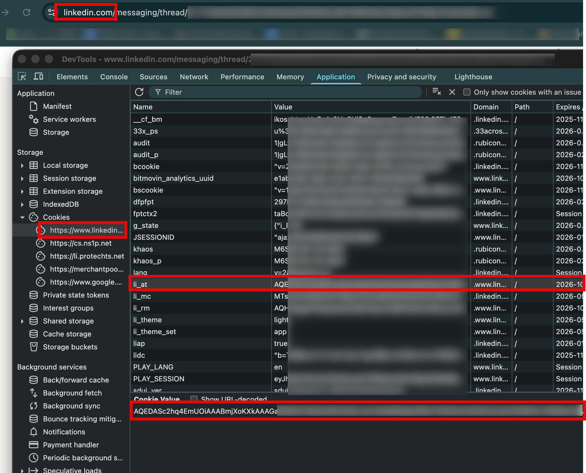

# nlp-fall-2025

## LinkedIn Job Scraper

This project contains a LinkedIn job scraper that collects job postings based on various job titles and saves them to CSV files.

### Prerequisites

- Python 3.7+
- Chrome browser installed
- LinkedIn account

### Installation

1. Install the required package:
```bash
pip install linkedin-jobs-scraper
```

### Setup - Important: LinkedIn Cookie Required

**You MUST obtain the `li_at` cookie from your LinkedIn account for the scraper to work.**

#### How to get your `li_at` cookie:

1. Open Chrome (or your preferred browser) and log into your LinkedIn account
2. Open Developer Tools (F12 or Right-click → Inspect)
3. Go to the **Application** tab (Chrome) or **Storage** tab (Firefox)
4. In the left sidebar, expand **Cookies** and click on `https://www.linkedin.com`
5. Find the cookie named `li_at`
6. Copy the **Value** of the `li_at` cookie (it will be a long string)



**Note:** Keep this cookie value private and secure. Do not share it or commit it to version control.

#### Configure the cookie in your code:

You'll need to pass the `li_at` cookie to the scraper. This is typically done by setting it in the Chrome options when initializing the scraper.

### Job Titles to be Scraped

**⚠️ Important: Update the job titles list based on your needs!**

Before running the script, you should modify the `job_titles` list in `linkedin.py` (lines 18-28) to include the job titles you want to scrape. The current list includes the following as an example:

- Digital Marketing Specialist, Business Development Manager
- Quality Assurance Analyst, Systems Administrator, Database Administrator, Cybersecurity Analyst, DevOps Engineer
- Mobile App Developer, Cloud Solutions Architect, Technical Support Engineer, SEO Specialist, Social Media Manager
- Content Marketing Manager, E-commerce Manager, Brand Manager, Public Relations Specialist, Event Coordinator
- Logistics Manager, Supply Chain Analyst, Operations Analyst, Risk Manager, Compliance Officer, Auditor, Tax Specialist
- Investment Analyst, Portfolio Manager, Real Estate Agent, Insurance Underwriter, Claims Adjuster, Actuary, Loan Officer, Credit Analyst, Treasury Analyst, Financial Planner
- Marketing Analyst, Market Research Analyst, Advertising Manager, Media Planner, Copywriter, Video Producer, Animator, Illustrator, Interior Designer, Architect
- Civil Engineer, Mechanical Engineer, Electrical Engineer, Chemical Engineer, Environmental Engineer, Biomedical Engineer, Industrial Engineer, Aerospace Engineer, Petroleum Engineer, Nuclear Engineer
- Pharmacist, Nurse Practitioner, Physician Assistant, Medical Laboratory Technician, Radiologic Technologist, Physical Therapist, Occupational Therapist, Speech-Language Pathologist, Dietitian, Respiratory Therapist
- Teacher, School Counselor, Librarian, Social Worker, Psychologist, Counselor, Therapist, Coach, Trainer, Recruiter

**Total: 70 different job titles**

**To customize:** Open `linkedin.py` and edit the `job_titles` list to include only the roles you're interested in. You can add or remove job titles as needed.

The script will scrape each job title sequentially with a random delay (60-240 seconds) between each title to avoid rate limiting.

### Usage

Run the scraper:
```bash

LI_AT_COOKIE="please put your li_at cookie here" python linkedin.py

```

### What it does

- Scrapes job listings for 70+ different job titles
- Filters for:
  - Full-time and internship positions
  - Remote work options
  - Mid to senior experience level
  - $100K+ base salary
  - Posted within the last month
- Saves each scrape session to a timestamped CSV file in the format: `linkedin_jobs_YYYYMMDD_HHMMSS.csv`
- Implements delays between requests to avoid rate limiting

### Output

Each CSV file contains the following columns:
- Job Title
- Company
- Company Link
- Date
- Date Text
- Job Link
- Insights
- Description Length
- Description

### Important Notes

- The scraper uses a 2-second delay between requests to avoid being rate-limited
- Runs in headless mode by default
- A random wait time (60-240 seconds) is added between different job title searches
- All scraped data is saved in the `scraps/` directory